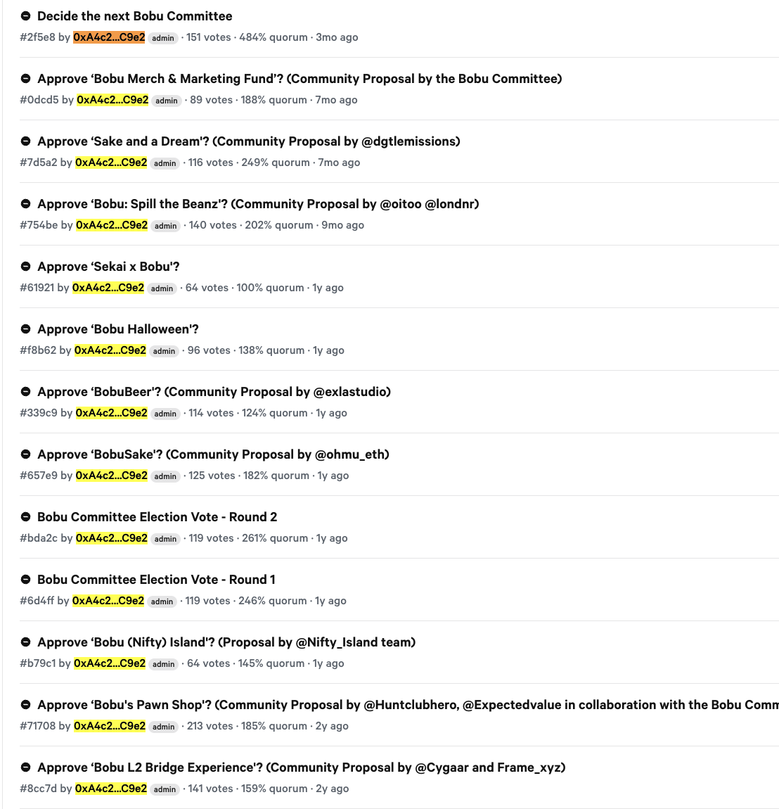

# Bobu Ideas
An open-source, on-chain forum for the Bobu community to draft and discuss ideas before admins publish finalized proposals to Snapshot.

- Live discussions eventually move to Snapshot: [Bobu on Snapshot](https://snapshot.box/?ref=bobu.ghost.io#/s:bobuthefarmer.eth)
- Project site: ideas.bobu.exchange

## Why this exists
As of 2025, Bobu’s proposal/discussion process has been relatively centralized in its discussion boards. The goal of Bobu Ideas is to decentralize planning by opening up ideation, drafts, and feedback to the community in public, on-chain.



## How to Contribute
This repository is open source and welcomes issues and pull requests.

- Propose: Open an issue for ideas, UX tweaks, or protocol changes
- Implement: Fork, branch, and open a PR with concise context and test steps
- Review: Keep changes small and focused; reference related issues/PRs

Notes:
- Hosted at ideas.bobu.exchange
- Entirely on-chain: Web UI and Web3 contracts

## Web UI Application
Location: `app/`

Quick start:
1) `cd app`
2) `npm i`
3) Set environment (optional):
   - `VITE_APP_ENV=testnet` (default) or `VITE_APP_ENV=mainnet`
4) Run:
   - Dev: `npm run dev`
   - Build: `npm run build`
   - Preview: `npm run preview`

Testnet notes:
- On Sepolia, a “Mint Testnet Bobu” helper appears for connected wallets.
- After submitting a new proposal, you’ll be redirected to the proposal page.

## Smart Contracts
Language: Vyper  
Tests: `ape` + `pytest`

Setup (example):
```
source /Users/theiss/Environments/vyperenv/bin/activate
pip install -r requirements.txt
ape test -s
```

## Repository Layout
- `app/` — React + Vite web application
- `contracts/` — Vyper contracts
- `scripts/` — helper scripts and ABIs
- `tests/` — contract tests
